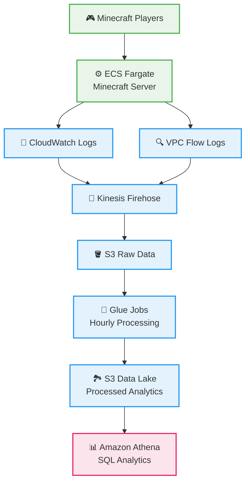
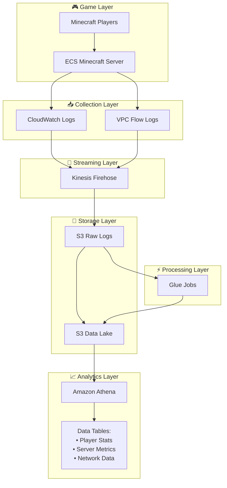
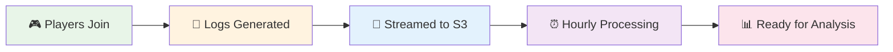
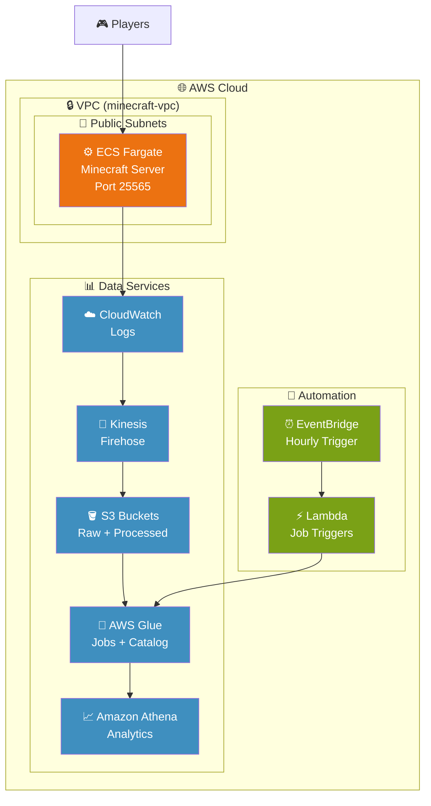
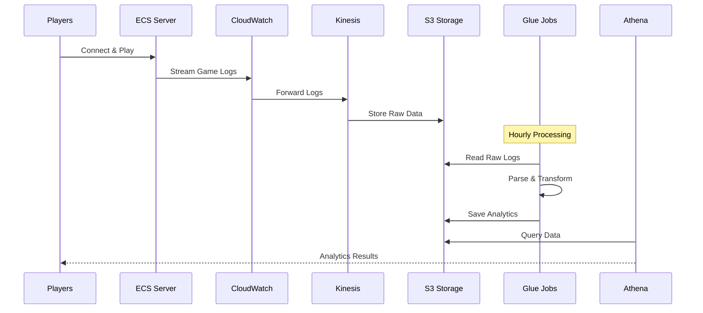
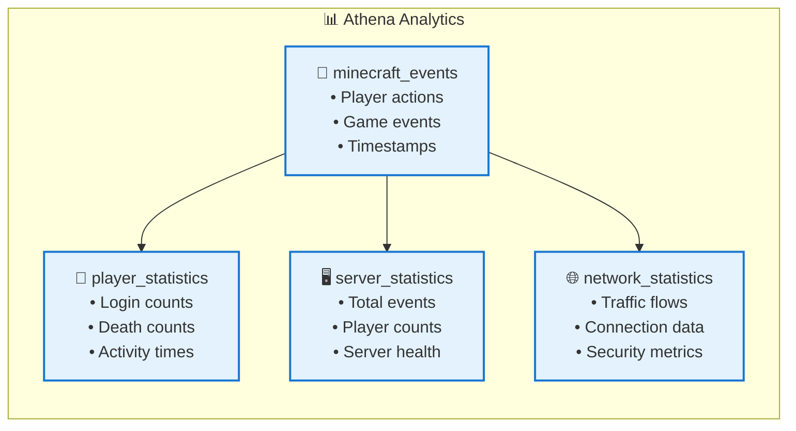
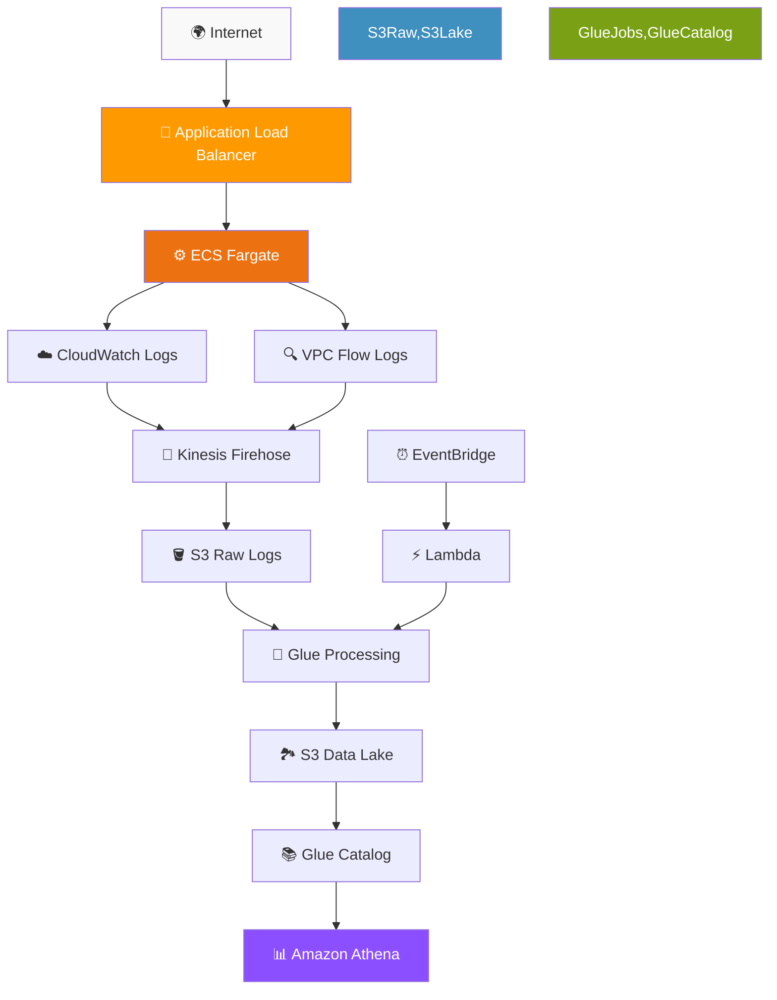

# Minecraft ECS Infrastructure & Data Pipeline Architecture

## 🎯 Simplified High-Level Architecture

## 📊 Data Flow Layers

## 🔄 Simple Data Processing Flow

## 🏗️ AWS Infrastructure Layout

## 🔄 Data Processing Workflow

## 📋 Analytics Tables Structure

## 🛠️ Service Dependencies

## Key Components Overview

### 🎮 **Game Infrastructure**
- **ECS Fargate Service**: Runs Minecraft server container
- **ServerTap Plugin**: Provides REST API for server statistics
- **Public Subnets**: Allow players to connect directly

### 📊 **Data Pipeline**
1. **Log Collection**: CloudWatch captures container logs and VPC flow logs
2. **Stream Processing**: Kinesis Firehose buffers and delivers to S3
3. **Batch Processing**: Glue jobs process logs hourly
4. **Data Cataloging**: Crawlers discover and register tables
5. **Analytics**: Athena provides SQL interface for querying

### 🔧 **Automation**
- **EventBridge**: Triggers processing every hour
- **Lambda Functions**: Start Glue jobs on schedule
- **IAM Roles**: Secure service-to-service communication

### 📈 **Analytics Tables**
- **minecraft_events**: Raw parsed game events
- **player_statistics**: Player behavior metrics
- **server_statistics**: Overall server health
- **network_statistics**: Traffic analysis
- **vpc_flow_logs**: Network security insights

This architecture enables real-time game hosting with comprehensive analytics, providing insights into player behavior, server performance, and network security. 